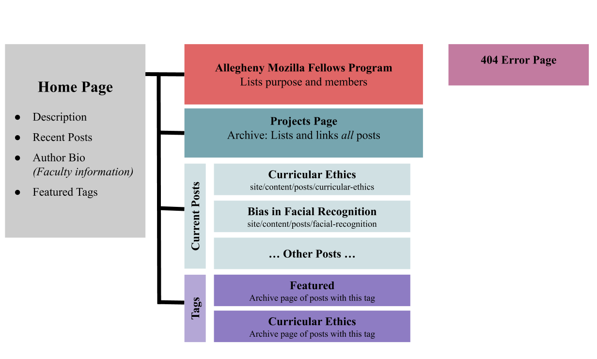

# Allegheny Ethical CS :crocodile:

[![BSD 3-Clause License][license-shield]][https://github.com/Allegheny-Mozilla-Fellows/EthicalCSWebsite/LICENSE.md]

## Table of Contents
* [About the Repository](#about-the-repository)
  + [Built With](#built-with)
* [Features](#features)
  + [Sitemap](#sitemap)
* [Getting Started](#getting-started)
  + [Prerequisites](#prerequisites)
  + [Develop Locally](#develop-locally)
* [Contributing](#contributing)
* [Contact](#contact)

## About the Repository

### A [website](https://csethics.allegheny.edu) created by the innovative Allegheny Mozilla Fellows team.  

The Department of Computer Science at Allegheny College launched the Allegheny Ethical CS initiative that aims to integrate responsible computing into its curriculum. This work, funded by the [Mozilla Responsible CS Challenge](https://foundation.mozilla.org/en/initiatives/responsible-cs/) grant, accomplishes this goal in a multitude of ways, including the establishment of the Allegheny Mozilla Fellows program, development of application-level course materials, as well as the creation and implementation of the proactive programming principles.

### Built with

  * [Gatsbyjs](https://www.gatsbyjs.org/)
  * [Yarn](https://classic.yarnpkg.com/en/)
  * [Node.js](https://nodejs.org/en/)
  * [Netlify](https://www.netlify.com/)
  * [Gatsby-theme-nehalem](https://github.com/nehalist/gatsby-theme-nehalem)

## Features
//

### Sitemap
This is the sitemap of our [website](https://csethics.allegheny.edu).

## Getting Started
//
### Prerequisites
//
### Developing Locally
//

## Contributing

We welcome everyone who is interested in helping improve this project! If you are interested in being a contributor, please review our [Code of Conduct](./CODE_OF_CONDUCT.md) and [Guidelines for Contributors](./CONTRIBUTING.md) before raising an issue, or beginning a contribution.

To create a pull request please follow this [template](./pull_request_template.md)

### Contact

If you have any questions or concerns about this project please contact:

- Dr. Jumadinova (jjumadinova@allegheny.edu)
- Kate Folkenroth (folkenrothk@allegheny.edu)
