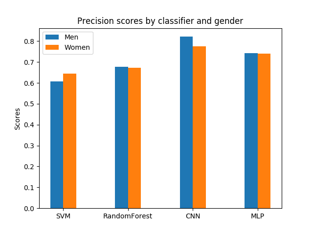

Facial recognition software is used in many industries, including but not limited to law enforcement, airports, healthcare facilities, technology manufacturing companies. As facial recognition technologies gain popularity there are some privacy and ethical concerns rising regarding the development and use of these tools. According to a report by the [National Institute of Standards and Technology](https://www.nist.gov/news-events/news/2019/12/nist-study-evaluates-effects-race-age-sex-face-recognition-software), commercial facial recognition tools exhibited biases with age, gender and race.

This is an important issue because biased facial recognition technology in law enforcement may lead to false accusations and arrests, or in airports it may cause delayed flights. Therefore the purpose of this project is to highlight ethical issues with face recognition technologies, compare efficiency of different classification algorithms and raise questions about development and use of face recognition tools.

This graph shows precision scores for four classifiers: SVM, RandomForest, CNN, MLP. Each classifier on the graph was tested on 1000 images of females and 1000 images of males. The classifiers guessed gender of the person on each image(binary classification). Precision score was calculated by *(tp / (tp + fp)* where *tp* is the number of true positives and *fp* the number of false positives. 0 is the worst score and 1 is the best score.
