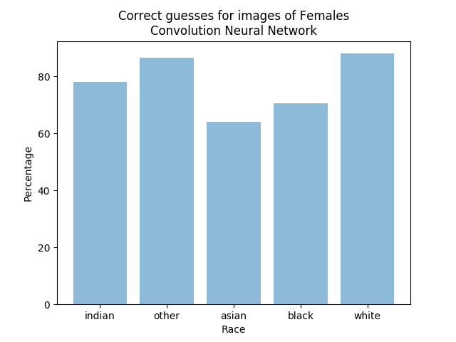
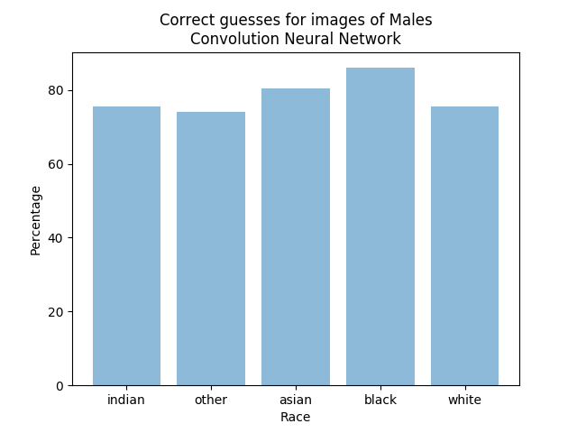

Facial recognition software is used in many industries, including but not limited to law enforcement, airports, healthcare facilities, technology manufacturing companies. As facial recognition technologies gain popularity there are some privacy and ethical concerns rising regarding the development and use of these tools. According to a report by the National Institute of Standards and Technology, commercial facial recognition tools exhibited biases with age, gender and race.

This is an important issue because biased facial recognition technology in law enforcement may lead to false accusations and arrests, or in airports it may cause delayed flights. Therefore the purpose of this project is to highlight ethical issues with face recognition technologies, compare efficiency of different classification algorithms and raise questions about development and use of face recognition tools.

## Graphs Made During Testing
This ran CNN for randomly picked 200 images per race group for both female and then male faces.

