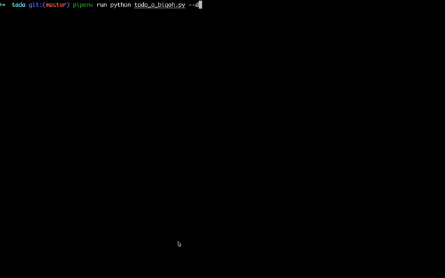

We believe that students who are taught to be proactive programmers will know how to avoid technical debt and then create more ethical software. This includes developing efficient and correctly working tools that are well-documented and can be easily used and integrated by other developers. In teaching students how to be proactive programmers we require them to use best practices in documentation, comments, and Git practices. For these tasks, we include appropriate checks into an automated grading tool developed in our department called [GatorGrader](https://github.com/GatorEducator/gatorgrader). We also encourage students to go "above and beyond" the minimal requirements of the programming assignments by adding “reach goals” into the GatorGrader tool.

We also contend that proactive programmers should care about the performance of their programs, which can then influence those who use it if the performance is poor. We developed a tool, called [Tada!](https://github.com/Tada-Project/tada), that automatically checks the performance of the programs for developers to ensure they avoid technical debt. We are also working on a Pytest plugin that will automatically find defects in a Python program to ensure its correctness.

### Tada!

  

