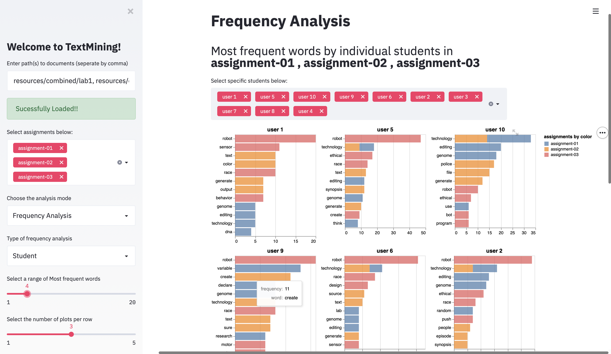
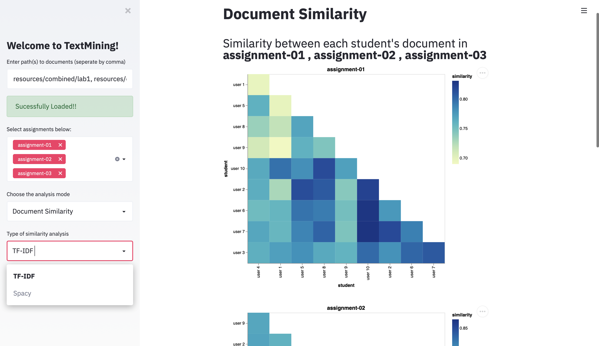

 

### The Project

In this project, we present an [automated text-mining tool](https://github.com/Allegheny-Mozilla-Fellows/textMining) written in `Python` to assist the department in measuring the technical responsibility of students across our department’s computer science curriculum. Although learning objectives and, hence, outcomes vary in each course, our tool provides its analysis by following broad learning categories around internet health, ethics and responsible computing, including students’ understanding of relevant issues, their ability to analyze and evaluate information, and their capacity for integrating the understanding and analysis of ethical thinking into their own work.

Our tool automatically collects reflection documents written by students from their GitHub repositories and using natural language processing analyzes them for ethical considerations based on predetermined questions and criteria. Various open-source Python libraries are deployed in the generation of the tool, including `SciKit Learn`, `NLTK`, `gensim`, `PyQt5`, `Streamlit`, and `Pytest`. Using our tool, it is possible to see the *progression* of a single student’s ethical thinking throughout a specific course and throughout the entire computer science curriculum, as well as, to have a *grand view* of all students’ progress in developing an understanding of social responsibility in computer science across all levels of our courses.

